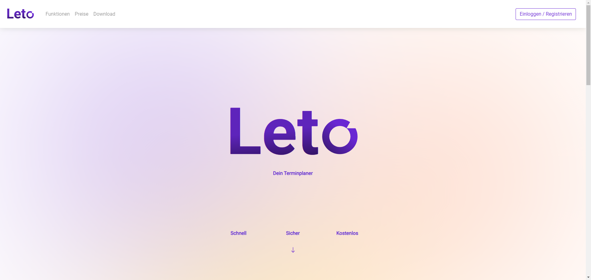

# Projekt: Optimierung einer VueJS-Web-App

Andreas Nicklaus
Web Performance Optimierung
20.01.2024

# Agenda

1. Probleme der Webseite
2. Gemachte Änderungen
3. Ergebnisse
4. Was fehlt noch?


# Die Webseite

[https://leto.andreasnicklaus.de](https://leto.andreasnicklaus.de)



# Infos zur Seite

- Marketing-Webseite für Desktopanwendung
- 6 animierte Elemente in der Startansicht
- 2 PNG-Bilder auf der Startseite
- Development:
  -  VueJS
  -  Bootstrap-Vue
  -  Vuetify
- Deployment:
  -  AWS EC2
  -  Docker
  -  Nginx Proxy Manager
  -  Nginx

# Seitenstruktur

- 9 statische & indexierte Seiten
- 3 dynamische & nicht-indexierte Seiten
  - Profilansicht
  - Admin-Dashboard
  - Checkout


# Probleme der Webseite
---

<!-- _class: resultTable loveTable -->

|                          |          |
| :----------------------- | -------: |
| Time To Interactive      |     4,6s |
| Largest Contentful Paint |     5,2s |
| Lighthouse Performance   |       33 |
| Page Weight              | 2,789 MB |

---

<!-- _class: resultTable foamTable -->

| Page Weight |       Bytes |
| :---------- | ----------: |
| Bilder      |   2 099 825 |
| JS          |     471 052 |
| CSS         |     221 358 |
| Fonts       |      15 744 |
| HTML        |         515 |
| **Gesamt**  | **~2,7 MB** |

# Änderungen
<!-- _class: resultTable goldTable leftTable -->
| Version | Änderungen                           |
| :------ | :----------------------------------- |
| v00     | -                                    |
| v01     | Prerendering für statische Seiten    |
| v02     | Render-Blocking Stylesheets entfernt |
| v03     | -                                    |
<!-- TODO: keine funktionalen Änderungen in v03??? -->

# Änderungen
<!-- _class: resultTable goldTable leftTable -->
| Version | Änderungen                                        |
| :------ | :------------------------------------------------ |
| v04     | -                                                 |
| v05     | AVIF-Bilder, Chained Request für Fonts entfernt   |
| v06     | Lineare Verteilung der Bildgrößen                 |
| v07     | Import nur der genutzten Icons anstelle von allen |
<!-- TODO: keine funktionalen Änderungen in v03??? -->

# Änderungen
<!-- _class: resultTable goldTable leftTable -->
| Version | Änderungen                                                  |
| :------ | :---------------------------------------------------------- |
| v08     | JS-Chunks gesplittet                                        |
| v09     | Animationen entfernt                                        |
| v10     | Alle Bilder werden lazy-loaded <div style="width: 700px;"/> |
| v11     | Zuerst sichtbare SVGs werden lazy-loaded                    |

# v01: Prerendering

```js
new PrerenderSpaPlugin({
  staticDir: path.join(__dirname, 'dist'),
  routes: routes.filter(r => r.meta?.prerender).map(r => r.path),
  renderer: new PrerenderSpaPlugin.PuppeteerRenderer({
    inject: {},
    renderAfterElementExists: '[data-view]',
  }),
  postProcess: (renderedRoute) => {
    renderedRoute.html = renderedRoute.html
      .replace(/<script (.*?)>/g, '<script $1 defer>')
      .replace('id="app"', 'id="app" data-server-rendered="true"');

      return renderedRoute;
    }
  })
```

<!-- TODO: LCP, FCP, LH Performance, TTI -->

# v02: Renderblocking-Stylesheets entfernt

```js
postProcess: (renderedRoute) => {
  renderedRoute.html = renderedRoute.html
    .replace(
      /<link href="(.*?)" rel="stylesheet">/g,
      `<link rel="preload" href="$1" as="style" onload="this.onload=null;this.rel='stylesheet'">
      <noscript>
        <link rel="stylesheet" href="$1">
      </noscript>`
    )
    .replace(
      /<link rel="stylesheet" (.*?)>/g,
      `<link rel="preload" $1 as="style" onload="this.onload=null;this.rel='stylesheet'">
      <noscript>
        <link rel="stylesheet" $1>
      </noscript>`
    )
    .replace(/<script (.*?)>/g, '<script $1 defer>')
    .replace('id="app"', 'id="app" data-server-rendered="true"');

    return renderedRoute;
  }
```

<!-- TODO: First Contentful Paint, TTI-Verschlechterung, CLS = 0 -->

# v03: Chained Request für Fonts entfernt

Bevor in `App.vue`:
```html
<style lang="scss">
  @import url("https://fonts.googleapis.com/css2?family=Roboto&display=swap");
</style>
```

Danach in `index.html`:
```html
<link
  rel="stylesheet"
  href="https://fonts.googleapis.com/css2?family=Roboto&display=swap"
/>
```

# v05: 

```html
<picture>
  <source
    :srcset="`${appleDevices_avif_1} 200w, ${appleDevices_avif_2} 783w, ${appleDevices_avif_3} 1123w, ${appleDevices_avif} 1920w`"
  />
  <source
    :srcset="`${appleDevices_webp_1} 200w, ${appleDevices_webp_2} 783w, ${appleDevices_webp_3} 1123w, ${appleDevices_webp} 1920w`"
  />
  
</picture>
```

# v05: Format Beispiel

- PNG: **611 kB**
- WEBP:
  - **126 kB** (Original)
  - **112 kB** (klein)
- AVIF:
  - **374 kB** (Original)
  - **48 kB** (klein)


<!-- TODO: Ladezeiten (Speed Index), Page Weight, TTI, CLS -->

# v06: Lineare Verteilung der Bildgrößen

vorher:
```html
<source
  :srcset="`${appleDevices_avif} 1920w, ${appleDevices_avif_3} 1123w,
  ${appleDevices_avif_2} 783w, ${appleDevices_avif_1} 200w`"
  sizes="(max-width: 768px) 100vw, 41.67vw"
/>
```
nachher:
```html
<source
  :srcset="`${appleDevices_avif} 1920w, ${appleDevices_avif_1} 1600w,
  ${appleDevices_avif_2} 1280w, ${appleDevices_avif_3} 960w,
  ${appleDevices_avif_4} 640w, ${appleDevices_avif_5} 320w`"
  sizes="(max-width: 768px) 100vw, 41.67vw"
/>
```

# v07: Import nur der genutzten Icons

```js
import { BootstrapVueIcons } from 'bootstrap-vue'
Vue.use(BootstrapVueIcons)
```
```js
import { BootstrapVue, BIconBoxArrowUpRight, BIconPerson, ... } from 'bootstrap-vue'

Vue.component("b-icon-box-arrow-up-right", BIconBoxArrowUpRight)
Vue.component("b-icon-person", BIconPerson)
...

```

# v08: JS-Chunks gesplittet

```js
configureWebpack: (config) => {
  config.optimization = {
    runtimeChunk: 'single',
    splitChunks: {
      chunks: 'all',
      maxInitialRequests: Infinity,
      maxSize: 500_000,
    }
  }
}
```

<!-- TODO: Länge der Liste der generierten JS-Dateien vergleichen -->

# v09: Animationen entfernt

mit Animationen (um 1100ms verzögert)

```html
<div
  data-aos="fade-up"
  data-aos-delay="1100"
  data-aos-anchor-placement="bottom"
>
  <b-button><b-icon-arrow-down variant="primary"/></b-button>
</div>
```
ohne Animationen:

```html
<div>
  <b-button><b-icon-arrow-down variant="primary"/></b-button>
</div>
```

# v10: Alle Bilder werden lazy-loaded

```html
<picture>
  <source .../>
  <source .../>
  
</picture>
```
# v10: Zuerst sichtbare SVGs werden lazy-loaded

```html

```

---

<!-- _class: resultTable foamTable -->

| Page Weight                          |      Bytes |
| :----------------------------------- | ---------: |
| Original                             |    2789 kB |
| v05: Bilder im AVIF-Format           |   -1649 kB |
| v06: lineare Bilder-Größenverteilung |    -362 kB |
| v07: Importiere nur genutzte Icons   |    -166 kB |
| **Gesamt**                           | **612 kB** |

---
<!-- _class: resultTable irisTable -->

| Lighthouse Performance | Score |
| :--------------------- | ----: |
| Original               |    33 |
| v01: Prerendering      |    57 |

<!-- TODO: insert graph -->

# Was fehlt noch?

Nach dem Lighthouse Performance Report:
- CSS Pruning
- Automatisiertes Treeshaking
- "Minimize main thread work"
- Preloading LCP-Bild
- Effizienteres Caching mit CDN

Nach Image Linter:
- Größere Bildversionen für große Bildschirme
